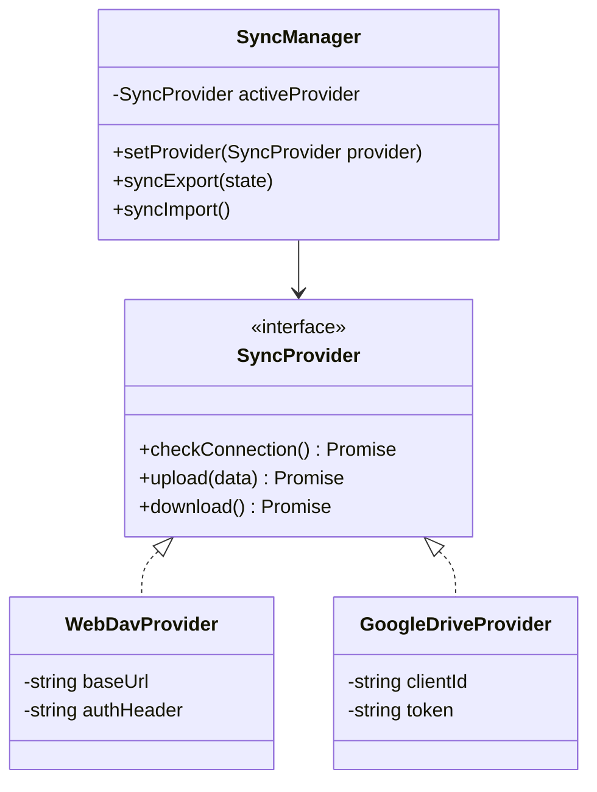

# Анализ реализации синхронизации и ее адаптация для Boosty Bookmark

В данном документе проведен подробный анализ механизмов синхронизации в расширении `more-boosty-remastered` и предложена гибкая **мультипровайдерная архитектура** для реализации синхронизации в **Boosty Bookmark**. 

Архитектура позволяет объединить преимущества нативной интеграции с Google Диском в Chrome и универсального стандарта WebDAV для кроссплатформенности (включая будущую поддержку Firefox).

---

## 1. Как устроена синхронизация в more-boosty-remastered

В расширении `more-boosty-remastered` синхронизация реализована через встроенное API браузеров — `chrome.storage.sync`.

### Технические детали:
1. **Переключение хранилищ:**
   В настройках есть флаг `sync` (хранится локально).
   - Если `sync === false` (по умолчанию), операции чтения и записи кэша, настроек и таймстаппов плееров направляются в `chrome.storage.local`.
   - Если `sync === true`, все те же операции перенаправляются в `chrome.storage.sync` (облачное хранилище Chrome, связанное с Google-аккаунтом пользователя).

2. **Процесс синхронизации (Кнопка «СИНХРОНИЗИРОВАТЬ»):**
   При переключении режимов или принудительном клике вызывается функция `syncCacheData(from, to)`.
   - Она считывает все данные (настройки `options` и таймстаппы `t:*`) из старого хранилища (например, `local`).
   - Записывает их в новое хранилище (например, `sync`).

---

## 2. Анализ ограничений chrome.storage.sync

Использование `chrome.storage.sync` накладывает жесткие лимиты со стороны Chrome API, что делает его непригодным для хранения больших объемов данных расширения:

| Параметр лимита | Значение лимита | Влияние на Boosty Bookmark |
| :--- | :--- | :--- |
| **QUOTA_BYTES** (Общий объем) | **102 400 байт (100 КБ)** | ❌ **Критично.** Наша база постов (`state.posts` для 1200+ постов) весит ~300 КБ. Синхронизировать её целиком в `sync` физически невозможно. |
| **QUOTA_BYTES_PER_ITEM** (Размер ключа) | **8 192 байта (8 КБ)** | ⚠️ **Опасно.** Прогресс пользователя (`state.user_data`) хранится в виде одного объекта. При большом количестве отслеживаемых тайтлов размер одного этого ключа легко превысит 8 КБ. |
| **MAX_ITEMS** (Количество ключей) | **512 ключей** | ⚠️ **Ограниченно.** Если мы решим разбить `user_data` по отдельным ключам для каждого тайтла, мы можем упереться в лимит 512 ключей. |

> [!IMPORTANT]
> **Проблема кроссплатформенности:**
> `chrome.storage.sync` привязан к экосистеме конкретного браузера. Он **не позволяет** синхронизировать данные между разными браузерами (например, если у пользователя на одном ПК Chrome, а на другом Firefox).

---

## 3. Предлагаемая мультипровайдерная архитектура (Все и сразу)

Для обеспечения максимальной свободы выбора пользователя и кроссплатформенности, синхронизация проектируется по паттерну **«Стратегия» (Strategy)**. Вся логика работы с конкретным облаком скрывается за единым абстрактным интерфейсом `SyncProvider`.



### 3.1 Провайдер 1: Google Drive (Нативный OAuth2)
Предназначен для бесшовного использования в браузерах семейства Chrome.

* **Как работает:** Использует встроенное API `chrome.identity.getAuthToken`. 
* **Авторизация:** Происходит в один клик через Google-аккаунт, привязанный к профилю браузера. Пользователю не нужно вводить пароли.
* **Где хранятся данные:** В скрытой и изолированной папке приложения `appDataFolder` на Google Диске пользователя. Пользователь не видит этот файл в общем списке диска, что защищает его от случайного удаления.
* **Особенности:** В Firefox требует использования `browser.identity.launchWebAuthFlow` с интерактивным окном авторизации.

### 3.2 Провайдер 2: WebDav (Универсальный стандарт)
Обеспечивает независимость от экосистемы Google и полную кроссплатформенность.

* **Как работает:** Отправляет стандартные HTTP-запросы (GET, PUT) на сервер провайдера.
* **Авторизация:** По логину и паролю приложения (Basic Auth).
* **Совместимые облака:** Яндекс.Диск, Nextcloud, Owncloud, pCloud, Koofr, Box.com, домашние NAS-серверы (Synology/QNAP).

---

## 4. Техническая реализация провайдеров

### 4.1 Формат файла синхронизации (`boosty_bookmark_backup.json`)
Мы **не синхронизируем** локальный кэш постов (`state.posts`), так как он весит слишком много и его можно загрузить по API Boosty.
Синхронизации подлежат только:
- Настройки расширения (`state.settings`).
- Прогресс прочитанных глав и отслеживаемых тайтлов (`state.user_data`).
- Сохраненные таймстампы медиаплееров (`state.playerTimestamps`).

```json
{
  "version": 1,
  "updatedAt": 1781423856000,
  "settings": {},
  "user_data": {},
  "playerTimestamps": {}
}
```

### 4.2 Код WebDavProvider
```javascript
class WebDavProvider {
  constructor(baseUrl, username, appPassword) {
    this.baseUrl = baseUrl;
    this.authHeader = 'Basic ' + btoa(username + ':' + appPassword);
  }

  async upload(data) {
    const response = await fetch(`${this.baseUrl}/boosty_bookmark_backup.json`, {
      method: 'PUT',
      headers: {
        'Authorization': this.authHeader,
        'Content-Type': 'application/json'
      },
      body: JSON.stringify(data)
    });
    return response.ok;
  }

  async download() {
    const response = await fetch(`${this.baseUrl}/boosty_bookmark_backup.json`, {
      method: 'GET',
      headers: { 'Authorization': this.authHeader }
    });
    if (response.status === 200) return response.json();
    if (response.status === 404) return null; // файла еще нет
    throw new Error('Ошибка WebDAV');
  }
}
```

### 4.3 Код GoogleDriveProvider
```javascript
class GoogleDriveProvider {
  async getAuthToken(interactive = false) {
    return new Promise((resolve, reject) => {
      chrome.identity.getAuthToken({ interactive }, (token) => {
        if (chrome.runtime.lastError) {
          reject(chrome.runtime.lastError);
        } else {
          resolve(token);
        }
      });
    });
  }

  async upload(data) {
    const token = await this.getAuthToken(true);
    
    // 1. Сначала ищем существующий файл в appDataFolder
    const fileId = await this.findFile(token);
    
    // 2. Если файл есть — обновляем (PATCH), если нет — создаем (POST)
    if (fileId) {
      return this.updateFile(fileId, data, token);
    } else {
      return this.createFile(data, token);
    }
  }

  // Внутренние методы поиска и работы с REST API Google Drive v3...
}
```

---

## 5. Слияние данных (Data Merging Strategy)

Поскольку бэкап может обновляться на разных устройствах асинхронно, при синхронизации используется стратегия слияния на основе временных меток (timestamps):
1. **Настройки:** Приоритет отдается настройкам с более поздним `updatedAt`.
2. **Прогресс постов (`user_data`):** Списки прочитанных глав объединяются (операция `Union`). Если глава была помечена как прочитанная на одном устройстве, она станет прочитанной и на другом.
3. **Таймстампы плееров:** Для каждого медиа-файла сохраняется таймстамп с более поздней датой последнего изменения.

---

## 6. Дорожная карта реализации (Roadmap)

Внедрение синхронизации планируется осуществлять поэтапно, от простых кроссплатформенных решений к нативным интеграциям:

1. **Этап 1: Синхронизация через WebDAV (Яндекс.Диск)**
   * Базовая реализация слияния данных.
   * Настройка UI (логин, пароль приложения).
   * WebDAV-клиент для работы с Яндекс.Диском (позволит закрыть базовую потребность во всех браузерах).

2. **Этап 2: Нативная синхронизация Google Drive в Chrome**
   * Внедрение `GoogleDriveProvider` через API `chrome.identity`.
   * Бесшовная привязка к Google-аккаунту без ручного ввода паролей для пользователей Google Chrome.

3. **Этап 3: Адаптация под Firefox**
   * Когда начнется разработка версии расширения под Firefox, провести интеграцию с API `browser.identity.launchWebAuthFlow` для поддержки Google Drive, либо оставить WebDAV в качестве основного метода синхронизации для этой платформы.

