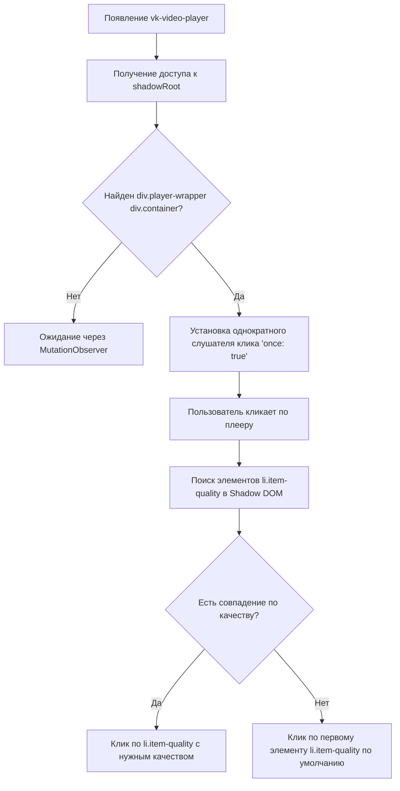

# Принудительное изменение качества видео (Force Video Quality) в плеере Boosty

В данном документе описан механизм работы функции автоматической установки качества видео, используемый в расширении **More Boosty Remastered**, и приведены рекомендации и примеры кода на чистом JavaScript для его интеграции в проект **Boosty Bookmark**.

---

## 1. Как устроен плеер на Boosty

На сайте Boosty видеоролики воспроизводятся через встроенный плеер VK, оформленный в виде веб-компонента `<vk-video-player>`. 
Вся внутренняя структура плеера изолирована в **Shadow DOM** этого элемента.

### Структура DOM плеера:
1. Веб-компонент: `<vk-video-player>`
2. Контейнер со скрытым DOM: `div.shadow-root-container` (содержит `#shadow-root`)
3. Внутри Shadow Root:
   - Главная обертка плеера: `div.player-wrapper`
   - Контейнер интерактива: `div.container` (внутри `div.player-wrapper`)
   - Элемент видео: `<video>`
   - Меню настроек качества (появляется в разметке управления):
     - Элементы списка: `li.item-quality` (каждый элемент содержит атрибут `data-value` со значением разрешения, например: `"1080p"`, `"720p"`, `"480p"`, `"360p"`, `"240p"`, `"144p"`).

---

## 2. Алгоритм работы функции

Процесс принудительной установки качества разделен на три ключевых шага:



### Шаг 1: Обнаружение плеера и доступ к Shadow DOM
Расширение отслеживает появление плееров на странице. Так как это веб-компонент, обычный `document.querySelector` не может заглянуть внутрь его Shadow DOM. Необходимо получить свойство `.shadowRoot` у родительского контейнера.

Селектор для поиска:
```css
vk-video-player .shadow-root-container
```

### Шаг 2: Ожидание готовности и привязка к первому клику
Поскольку элементы управления плеера (включая список качеств `li.item-quality`) генерируются и инициализируются динамически при запуске, расширение вешает **однократный** обработчик клика (`{ once: true }`) на элемент `div.player-wrapper div.container` внутри Shadow DOM. Это позволяет применить качество ровно в тот момент, когда пользователь впервые нажал на видео для начала просмотра, и плеер стал готов к интерактиву.

### Шаг 3: Программный клик по пункту меню качества
При срабатывании клика запускается функция выбора качества:
1. Происходит поиск всех элементов `li.item-quality`.
2. Перебираются доступные значения `dataset.value` (например, `"1080p"`).
3. При совпадении с выбранной пользователем настройкой эмулируется клик: `quality.click()`.
4. Если точного совпадения нет (например, видео загружено максимум в 720p, а у пользователя стоит 1080p), скрипт кликает по первому доступному элементу (`itemQuality[0]`), который обычно соответствует максимально доступному качеству.

---

## 3. Список поддерживаемых качеств (Enums)

В плеере используются следующие строковые значения разрешений:

| Опция (Настройка) | Значение `data-value` (в DOM) | Описание |
| :--- | :--- | :--- |
| **2160p** | `"2160p"` | Ultra HD / 4K |
| **1440p** | `"1440p"` | Quad HD / 2K |
| **1080p** | `"1080p"` | Full HD |
| **720p** | `"720p"` | High / HD |
| **480p** | `"480p"` | Medium / SD |
| **360p** | `"360p"` | Low |
| **240p** | `"240p"` | Lowest |
| **144p** | `"144p"` | Tiny |

---

## 4. Пример JS-кода для интеграции в Boosty Bookmark

Ниже представлен адаптированный для нашего проекта JavaScript-код, который можно внедрить в `content.js` нашего расширения.

### Определение функции клика по качеству:
```javascript
/**
 * Устанавливает выбранное качество видео в плеере
 * @param {HTMLElement} playerWrapper - Обертка плеера из Shadow DOM (.player-wrapper)
 * @param {string} targetQuality - Целевое качество (например, "1080p")
 */
function forceVideoQuality(playerWrapper, targetQuality) {
    const itemQualities = playerWrapper.querySelectorAll('li.item-quality');
    
    if (itemQualities.length === 0) {
        console.warn('[Boosty Bookmark] Элементы выбора качества не найдены в DOM плеера.');
        return;
    }

    // Ищем элемент с нужным качеством
    for (const qualityEl of itemQualities) {
        if (qualityEl.dataset.value === targetQuality) {
            console.debug(`[Boosty Bookmark] Найдено и установлено качество: ${targetQuality}`);
            qualityEl.click();
            return;
        }
    }

    // Если точное совпадение не найдено, выбираем первый доступный вариант (обычно максимальный)
    console.debug(`[Boosty Bookmark] Качество ${targetQuality} недоступно. Выбрано авто/максимальное качество по умолчанию.`);
    itemQualities[0].click();
}
```

### Подключение к жизненному циклу плеера:
```javascript
/**
 * Инициализирует слежение за плеером и вешает триггер на клик
 * @param {HTMLElement} shadowRootContainer - Контейнер .shadow-root-container веб-компонента
 * @param {string} targetQuality - Целевое качество видео
 */
function setupVideoPlayerQuality(shadowRootContainer, targetQuality) {
    const shadowRoot = shadowRootContainer.shadowRoot;
    if (!shadowRoot) return;

    const attachClickListener = () => {
        const playerWrapper = shadowRoot.querySelector('div.player-wrapper');
        const clickTarget = shadowRoot.querySelector('div.player-wrapper div.container');

        if (!playerWrapper || !clickTarget) return false;

        // Вешаем однократный клик
        clickTarget.addEventListener('click', () => {
            console.debug('[Boosty Bookmark] Первый клик по плееру зафиксирован. Принудительно выставляем качество...');
            // Небольшая задержка, чтобы дать внутреннему реакту плеера построить меню
            setTimeout(() => {
                forceVideoQuality(playerWrapper, targetQuality);
            }, 50);
        }, { once: true });

        shadowRootContainer.dataset.lfQualityInjected = 'true';
        return true;
    };

    // Пробуем подключиться сразу
    if (attachClickListener()) return;

    // Если элементы еще не отрендерились внутри shadowRoot, следим за изменениями
    const observer = new MutationObserver((mutations, obs) => {
        if (attachClickListener()) {
            obs.disconnect();
        }
    });

    observer.observe(shadowRoot, {
        childList: true,
        subtree: true
    });
}
```

### Интеграция в глобальный наблюдатель за DOM (MutationObserver):
В основной цикл отслеживания элементов (где ищутся новые посты/комментарии) добавляется вызов инициализатора для каждого немаркированного плеера:
```javascript
function processNewElementsOnPage() {
    // ... остальная логика парсинга ...
    
    // Если в настройках включен форс качества (например, state.settings.forceVideoQuality === true)
    if (state.settings.forceVideoQuality) {
        const targetQuality = state.settings.videoQuality || '1080p';
        
        const players = document.querySelectorAll('vk-video-player .shadow-root-container:not([data-lf-quality-injected="true"])');
        players.forEach(player => {
            setupVideoPlayerQuality(player, targetQuality);
        });
    }
}
```

---

## 5. Требуемые изменения в интерфейсе настроек

Для полноценного внедрения этой функции в **Boosty Bookmark** потребуется добавить два элемента управления на вкладку настроек:

1. **Чекбокс (Вкл/Выкл):** 
   - Название: `Запоминать и принудительно устанавливать качество видео` (или `Принудительное качество видео`).
   - Ключ в БД/хранилище: `forceVideoQuality` (по умолчанию `false` или `true` на усмотрение автора).
2. **Выпадающий список (Выбор разрешения):**
   - Название: `Предпочитаемое качество`
   - Опции: `2160p`, `1440p`, `1080p`, `720p`, `480p`, `360p`, `240p`, `144p`.
   - Должен быть заблокирован (`disabled`), если чекбокс выключен.
   - Ключ в БД/хранилище: `videoQuality` (значение по умолчанию: `'1080p'`).
